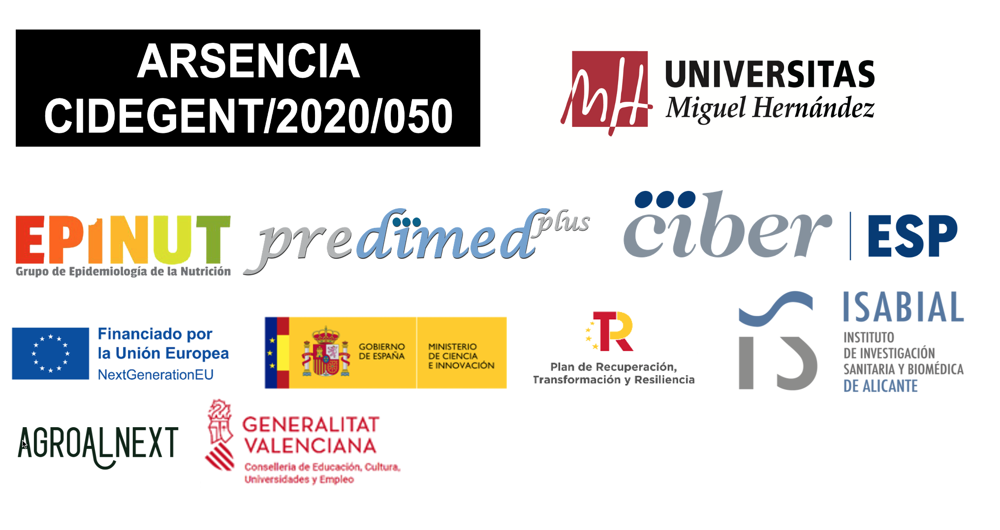

# Jornadas_ARSENCIA_2024_en

 

 

[Versión en Español](https://tonis81.github.io/Jornadas_ARSENCIA_2024/)

## November 28-29, 2024 at the [Salon de Grados, Edificio Valona](https://www.google.com/maps/search/Salon+de+Grados+edificio+Valona+UMH/@38.2737078,-0.6858573,15.86z?entry=ttu&g_ep=EgoyMDI0MDkwOS4wIKXMDSoASAFQAw%3D%3D)(Universidad Miguel Hernández) in Elche (Universidad Miguel Hernández)

 

  
  
<a href="mailto:jornadasarsencia@gmail.com">jornadasarsencia@gmail.com</a>

  
<a href="https://docs.google.com/forms/d/e/1FAIpQLScIfY-1FIBzalcdYrARaMbFcnxCOlpydFOttYMIVB-W0YJmUg/viewform">Registration link</a>

  
<a href="https://docs.google.com/forms/d/e/1FAIpQLSdyGG_DA9wiuElFUp80cyRSuWOf8m4h7CgVNSFPJQTzNLBPqQ/viewform"> Registration communication submission</a>

  
<a href="https://drive.google.com/drive/folders/1GMEf6Q1cIKK-5A3YU4VQiUWtfoz0FgbQ?usp=drive_link">Download templates</a>

## Presentation

<em>Health and nutrition are closely linked. The quantity and variety of foods in our diet, along with food production models currently being revised to promote greater sustainability, can influence both nutrient intake and exposure to harmful substances.
</em>

<em>High adherence to the Mediterranean diet or other healthy plant-based food patterns over time significantly contributes to promoting good health. However, foods can also contain toxic elements, such as arsenic, whose chronic exposure, even at relatively low concentrations, can negatively impact health. Moreover, its harmful effect can be potentiated by interactions with other elements. Therefore, it is crucial to develop models to assess health risks associated with exposure to toxic agents, especially for vulnerable individuals such as pregnant women, infants, children, and the elderly.
  </em>

<em>During these sessions, scientific evidence on the importance of diet for health, as well as exposure to toxic metals through food, will be presented, and strategies and opportunities to reduce it will be discussed. Evidence generated from ongoing projects at the Miguel Hernández University (UMH), such as ARSENCIA, part of the GenT program funded by the Generalitat Valenciana, the PREDIMED Plus study, HidroSOStoneFruit, ThinkinAzul, and a recent project on the transmission of the Mediterranean diet from mothers to children funded by the Carlos III Health Institute, will be highlighted. To achieve this goal, a dual scientific and educational approach will be adopted to facilitate interactions between undergraduate, master's, and doctoral students from various related disciplines with researchers and present their work. Additionally, participants in the studies will be given a voice to express their perceptions, ideas, and concerns about food, and explore the possibility of integrating them into future collaborative research projects.
</em>

<em>With this purpose in mind, various activities have been planned, including gathering information on attendees' diets through questionnaires to evaluate their adherence to healthy eating practices, as well as presentations by renowned researchers and demonstration workshops. Based on all the information collected during the event, it is expected to develop a guide or report on good practices that will help promote the consumption of foods that contribute to a balanced and healthy diet.
</em>

## Agenda

### Program Day 1 - November 28, 2024

> #### 9:00 Attendee reception

> #### 9:30 Opening ceremony
>
> #### Speaker: Prof. Ángel Carbonell Barrachina
>
> Description: The Prof. Ángel Carbonell Barrachina, Vice-Rector for Research and Transfer at UMH, will officially open the sessions.

> #### 9:45 Nutritional Epidemiology
>
> Speaker: Prof. Jesús Vioque López
>
> Description: Prof. Jesús Vioque López is the director of the Nutrition Epidemiology research group (EPINUT), where these sessions were developed. Prof. Vioque will introduce the role of diet in health.

> #### 10:15 Pollution and Health
>
> Speaker: Dr. Antonio J. Signes Pastor
>
> Description: Dr. Antonio J. Signes Pastor is a Senior Researcher funded by the GenT program of the Generalitat Valenciana. Dr. Signes Pastor will present the role of trace element epidemiology, including its perspective on food safety and quality.

> #### 10:45 Coffee break

> #### 11:15 The role of statisticians in clinical contexts
>
> Speaker: Dr. Pablo Martínez Camblor
>
>Description: Brief personal historical overview of my more than 25 years in biostatistics. I will analyze the changes and evolution of methods and the perception of statistics, as well as fundamental topics in current science such as reproducibility, causal contexts, and similar concepts.

> #### 11:45 Association between exposure to metal mixtures and neurodevelopment in INMA children
>
> Speaker: Dr. Susana Díaz Coto
>
> Description: Dr. Susana Díaz Coto will present the work she leads on exposure to metal mixtures and neurological development in children aged 4 to 5 years, as part of the INfancia y Medio Ambiente (INMA) cohort study.

> #### 12:15 Environmental exposure in the NHBCS birth cohort study
>
> Speaker: Dr. Leyre Notario Barandiarán
>
> Description: Dr. Leyre Notario Barandiarán will present the New Hampshire Birth Cohort Study (NHBCS) and detail her research on dietary metal exposure.

> ### 12:45 Metals in mothers and children of the NELA cohort
>
> Speaker: Dr. Eva Morales Bartolomé
>
> Description: Dr. Eva Morales Bartolomé will present the Nutrition in Early Life and Asthma (NELA) birth cohort and discuss her research on metal exposure during pregnancy and childhood.

> ### 13:15 Active break

> ### 13:30 Tapas and Gurus Lunch

> ### 15:00 Student poster session

> ### 17:30 Award ceremony and end of day 1 sessions

----

### Program Day 2 - November 29, 2024

> ### 9:00 Attendee reception

> ### 9:30 Agroalnext Project - Regulated Deficit Irrigation
>
> Speaker: Dr. Lucia Andreu Coll
>
> Description: Dr. Lucía Andreu Coll will introduce the Agroalnext project and present her research on the Impact of Regulated Deficit Irrigation on Antioxidant Activity, Fatty Acid Profile, Volatile Compounds, and Fruit Quality in 'Mirlo Rojo' Apricots.

> #### 9:45 Acuicultura, calidad e innovación (AQUI)
>
> Ponente: Dr. Marina Cano Lamadrid
>
> Description: One of the objectives of the project is the characterization of formulated feeds for farmed gilthead seabream using alternative proteins, along with the evaluation of the effect of feeding these feeds throughout the entire life cycle on the content of abiotic contaminants in the edible parts and viscera.

> ### 10:00 Transmission of the Mediterranean Diet in childhood in INMA
> 
> Speaker: Dr. Sandra González Palacios
>
> Description: Dr. Sandra González Palacios will present the INMA cohort and its findings on the transmission of the Mediterranean diet from mothers to children, its association with environmental contaminants and cardiometabolic risk.

> ### 10:15 Active break

> ### 10:30 Coffee break

> ### 11:00 Experience of participants in the Predimed-Plus project
>
>Speaker: xxxxx
>
>Description: Predimed-Plus evaluates the effect of an intensive lifestyle intervention aiming at losing weight with an energy-restricted Mediterranean diet, physical activity promotion and behavioral support on the primary prevention of cardiovascular diseases.

> ### 11:30 Sensorial analysis Tasting - To be defined
>
> Speaker: Dr. Luis Noguera Artiaga
>
> Description: Dr. Luís Noguera Artiaga will give an introduction to sensory analysis and guide us through a tasting.

> ### 13:00 Closing ceremony
>
> Dr. Antonio J. Signes Pastor

> ### 13:30 End of ARSENCIA Sessions

## **Speakers**

> ### National
>
> 

> 
> 
Marina Cano Lamadrid - <a href="mailto:marina.canol@umh.es">marina.canol@umh.es</a>. Postdoctoral researcher at UMH, member of the Food Quality and Safety Group in the Department of Agro-Food Technology and researcher at CIAGRO-UMH. Expert in Food Sensory Analysis and Food Safety. Collaborator in the ThinkinAzul project.

> 

> 

> 
> 
Eva Morales Bartolomé - <a href="mailto:evamorales@um.es">evamorales@um.es</a>. Assistant Professor of Preventive Medicine and Public Health at the University of Murcia, and member of the Pediatric Research Group at IMIB-Arrixaca. Co-director of the NELA cohort, studying the early environmental impacts on childhood respiratory health, particularly asthma and allergies. Executive committee member of GAN and member of CIBERESP. Her research focuses on birth cohort studies, asthma epidemiology, and environmental and molecular epidemiology.

> 

>

>
>
Luis Noguera Artiaga - <a href="mailto:lnoguera@umh.es">lnoguera@umh.es</a>. Assistant Professor at UMH. Member of the Food Quality and Safety Research Group at the Agro-Food and Agro-Environmental Research and Innovation Institute of UMH. His research focuses on the study of sensory analysis in food and the impact that agricultural practices have on its quality. Additionally, he studies the impact of aroma on the taste and quality of food through the analysis of its volatile organic compounds. He is the director of the Tasting Panel for the Protected Designation of Origin Alicante Wines and the director of the Tasting Panel for the Protected Designation of Origin Murcia Paprika.

>

>

>
>
Lucía Andreu Coll - <a href="mailto:l.andreu@umh.es">l.andreu@umh.es</a>. Doctor in Agricultural, Agro-environmental, and Food Resources and Technologies from Miguel Hernández University. Member of the research group in Pomology and Production Techniques at CIAGRO-UMH. Her research focuses on the production and quality of environmentally sustainable crops. Currently collaborating on the AGROALNEXT/2022/040 project, evaluating deficit irrigation techniques in stone fruit trees.

>

> ### **International**

>

>
>
Pablo Martinez Camblor - <a href="mailto:Pablo.Martinez-Camblor@hitchcock.org">Pablo.Martinez-Camblor@hitchcock.org</a>. "Research Biostatistician" at Dartmouth Health (New Hampshire, USA), with a PhD in Mathematical Statistics from the University of Oviedo (Asturias). With over 25 years of experience in Public Health and clinical research, he has worked at institutions such as CIMERA, the Public Health Department of Guipúzcoa, and the Central University Hospital of Asturias (HUCA). He has taught courses at several universities, including Dartmouth College, where he currently participates in the Master's program in Quantitative Biomedical Sciences at the Geisel School of Medicine.

>

>

>
>
Susana Díaz Coto - <a href="mailto:Susana.Diaz.Coto@hitchcock.org">Susana.Diaz.Coto@hitchcock.org</a>. PhD in Mathematics and Statistics from the University of Oviedo and Senior Scientist at Dartmouth Health, where she currently provides methodological support in Statistics to the Department of Orthopedics. Previously, she worked in the Department of Epidemiology at Dartmouth College, collaborating on the NHBCS and ECHO studies. She also collaborates on the INMA study. Her research focuses on nonparametric estimation methods for evaluating the discriminatory capacity of biomarkers in binary classification problems.

>

>

>
>
Leyre Notario Barandiaran - <a href="mailto:Leyre.Notario.Barandiaran@dartmouth.edu">Leyre.Notario.Barandiaran@dartmouth.edu</a>. Postdoctoral researcher in the Epidemiology group at Dartmouth College (Geisel School of Medicine). Main research areas: Nutritional Epidemiology and Environmental Epidemiology in relation to various outcomes such as neurodevelopment and cardiovascular health. Collaborating researcher in internationally relevant studies such as PREDIMED-Plus, and the INMA, NELA, and NHBCS birth cohort studies. Also participates as a collaborating researcher in various projects in the NIH ECHO program.

>

>
>

> ## **Organizing Committee**:

> ### President

>

>
>
Antonio José Signes Pastor - <a href="mailto:asignes@umh.es">asignes@umh.es</a>. Senior researcher CIDEGENT at the Universidad Miguel Hernández (UMH) and the Alicante Health and Biomedical Research Institute (ISABIAL). Member of the CIBER of Epidemiology and Public Health (CIBERESP). Expert in contaminants and trace elements. Principal investigator of the ARSENCIA project, co-principal investigator of the HidroSOStoneFruit project, and collaborator in the PREDIMED, PI23/01568, and ThinkinAzul projects.

>

> ### Committee members

>

>
>
Jesús Vioque López - <a href="mailto:vioque@umh.es">vioque@umh.es</a>. Professor of Preventive Medicine and Public Health at the UMH. He obtained a master's degree in public health and training in nutritional epidemiology at Harvard. He leads the  Nutrition Epidemiology Group (EPINUT), which investigates the role of diet in non-communicable diseases. He has led studies such as PANESOES, on diet and cancer risk, and the INMA Study, on contaminants and child development. His group participates in PREDIMED-PLUS, which evaluates a hypocaloric Mediterranean diet on cardiovascular risk and diabetes.

>

>
>
Manuela Garcia De La Hera - <a href="mailto:manoli@umh.es">manoli@umh.es</a>. Professor of Preventive Medicine and Public Health at the UMH. Member of the EPINUT group, focused on investigating the role of diet in the risk of non-communicable diseases. She has conducted studies on survival, lifestyle, and diet, as well as on Nutritional Epidemiology and Occupational Therapy in Neurodevelopmental Disorders. Collaborator in the INMA and PREDIMED-PLUS studies, and co-author of the mobile app Anticipa-TEA, aimed at children with Autism Spectrum Disorder.

>

>

>
>
Laura Torres Collado - <a href="mailto:l.torres@umh.es">l.torres@umh.es</a>. Assistant Professor in Public Health at UMH and postdoctoral researcher in the EPINUT group at UMH. Affiliated with ISABIAL and CIBERESP, her research focuses on lifestyle, diet, and survival in adults, as well as the epidemiology of Nutrition and Occupational Therapy in Neurodevelopmental Disorders. She collaborates in the PREDIMED-Plus study and is co-author of the Anticipa-TEA app for children with Autism Spectrum Disorder.

>

>

>
>
Alejandro Oncina Canovas - <a href="mailto:aoncina@umh.es">aoncina@umh.es</a>. Postdoctoral researcher in the EPINUT group at UMH. Affiliated with ISABIAL and CIBERESP. His main research line focuses on examining the association between adherence to pro-vegetarian dietary patterns (diets that mimic vegetarian diets) and various health outcomes. Additionally, he is a collaborating researcher in ARSENCIA and other internationally relevant studies such as PREDIMED-Plus and the INMA cohort study.

>

>

>
>
Laura Maria Compañ Gabucio - <a href="mailto:lcompan@umh.es">lcompan@umh.es</a>. Postdoctoral researcher in the EPINUT group at UMH. Affiliated with ISABIAL and CIBERESP. Main research lines: Epidemiology of Nutrition and Occupational Therapy in Neurodevelopmental Disorders. Collaborating researcher in internationally relevant studies such as PREDIMED-Plus and the INMA Project. Co-author of the mobile application Anticipa-TEA, aimed at children with Autism Spectrum Disorder and their families.

>

>

>
>
Carolina Ojeda Belokon - <a href="mailto:cojeda@umh.es">cojeda@umh.es</a>. Graduated in Human Nutrition and Dietetics from the University of Alicante (UA) and holds a Master's in Public Health, jointly from UMH and UA. Currently, she has a predoctoral contract at UMH in the EPINUT group, participating in various projects such as PREDIMED-Plus, and is conducting her doctoral thesis in the Public Health, Medical, and Surgical Sciences Doctoral Program at UMH.

>

>

>
>
Diana Mancheño Bañon - <a href="mailto:dmancheno@umh.es">dmancheno@umh.es</a>. Graduated in Occupational Therapy from UMH and holds a Master's in Public Health, jointly from UMH and UA. Currently, she has a contract from the ISABIAL INVESTIGO Program as a collaborating researcher in the EPINUT group at UMH, participating in various projects such as PREDIMED-Plus, and is conducting her doctoral thesis in the Public Health, Medical, and Surgical Sciences Doctoral Program at UMH.

>

>

>
>
Maria Del Carmen Esquiva Antolino - <a href="mailto:mesquiva@umh.es">mesquiva@umh.es</a>. Graduated in Veterinary Medicine from the University of Murcia (UMU) and holds a Master's in Public Health, jointly from UMH and UA. Currently, she has a contract from the ISABIAL INVESTIGO Program as a collaborating researcher in the EPINUT group at UMH, participating in various projects such as PREDIMED-Plus, and is conducting her doctoral thesis in the Public Health, Medical, and Surgical Sciences Doctoral Program at UMH. 

>

>

>
>
Sandra Gonzalez Palacios - <a href="mailto:sandra.gonzalezp@umh.es">sandra.gonzalezp@umh.es</a>. Postdoctoral researcher at CIBER in Epidemiology and Public Health (CIBERESP). Member of the EPINUT group and ISABIAL. Dietitian-Nutritionist, Doctor in Public Health, and specialist in Nutritional Epidemiology. Principal investigator of the FIS PI23/01568 project and the Intramural CIBERESP ESP24PI02 Project. Collaborator in other studies such as PREDIMED Plus and the INfancia y Medio Ambiente study.

>

>

## **Evaluation Committee**:

>

>
Esther Sendra Nadal - <a href="mailto:esther.sendra@umh.es">esther.sendra@umh.es</a>. Professor of Food Technology at UMH, member of the research group on Food Quality and Safety at the Agro-Food and Environmental Research Institute. PhD in Veterinary Science, teaches Food Standardization and Legislation. Her research focuses on the impact of agronomic practices on the fat fraction and bioactive compounds in agricultural products, and the use of alternative raw materials in animal diets. She is the Director of the Master's in Agroecology, Rural Development, and Agritourism, and principal investigator in a Marine Sciences subproject under ThinkInAzul.

>

>
Francisca Hernández García - <a href="mailto:francisca.hernandez@umh.es">francisca.hernandez@umh.es</a>. Professor at UMH, member of the Fruit Growing and Production Techniques Research Group, Senior Researcher at CIAGRO-UMH, and member of the Academic Committee of the Doctoral Program in Agricultural, Environmental, and Food Resources and Technologies. Expert in Fruit Growing and Production Techniques. Principal investigator of the HidroSOStoneFruit project and collaborator in the ThinkinAzul project.

>

>
Miguel García-Villarino - <a href="mailto:garciavmiguel@uniovi.es">garciavmiguel@uniovi.es</a>. Associate Professor in the Area of Preventive Medicine and Public Health at the University of Oviedo. Affiliated with the Health Research Institute of the Principality of Asturias and the University Institute of Oncology of the Principality of Asturias. His main research priorities include the use of data to improve care for people with diabetes and the epidemiological study of exposure to environmental pollutants and their impact on human health, with a focus on type 2 diabetes mellitus in the Principality of Asturias.

>

>
Rocío Fernández Iglesias - <a href="mailto:fernandezirocio@uniovi.es">fernandezirocio@uniovi.es</a>. Professor of Statistics and Operations Research and Mathematics Education at the University of Oviedo, and Doctor in Biomedicine and Molecular Oncology from the same university. Her main line of research focuses on the application of statistical methods in the field of epidemiology and public health. She is affiliated with the Health Research Institute of the Principality of Asturias and the University Institute of Oncology of the Principality of Asturias.

>

>
Sonia Pérez Fernández - <a href="mailto:soniapfdez@gmail.com">soniapfdez@gmail.com</a>. Doctor in Mathematics and Statistics from the University of Oviedo and the Vienna University of Technology. She currently works as an Assistant Professor in the area of Statistics and Operations Research at the University of Oviedo, collaborating on projects aimed at advancing comparison, classification, and data analysis in socioeconomic and biosanitary environments. Her research focuses on the generalization of the ROC curve to explore binary classification sets that optimize the discriminatory capacity of univariate and multivariate biomarkers.

> ## **Scientific Committee**:

> ### President

> Antonio J. Signes Pastor, Universidad Miguel Hernández (Spain)

> ### Committee Members

> Jesús Vioque López, Universidad Miguel Hernández (Spain)

> Manuela García de la Hera, Universidad Miguel Hernández (Spain)

> Laura Torres Collado, Universidad Miguel Hernández (Spain)

> Sandra González Palacios, Universidad Miguel Hernández (Spain)

> Alejandro Oncina Cánovas, Universidad Miguel Hernández (Spain)

> Laura M. Compañ Gabucio, Universidad Miguel Hernández (Spain)

> Carolina Ojeda Belokon, Universidad Miguel Hernández (Spain)

> Diana Mancheño Bañón, Universidad Miguel Hernández (Spain)

> María del Carmen Esquiva Antolino, Universidad Miguel Hernández (Spain)

> Leyre Notario Barandiaran, Dartmouth College (United States)

>

>
Jacek Lyczko (Poland)- <a href="mailto:jacek.lyczko@upwr.edu.pl">jacek.lyczko@upwr.edu.pl</a>. Jacek Lyczko, Ph.D., graduated from the Faculty of Biotechnology and Food Sciences, University of Life Sciences in Wroclaw, in 2017. He earned his doctoral degree in food technology and nutrition in 2021 and his habilitation in 2024. Currently, he works in the Department of Food Chemistry and Biocatalysis at UPWr. Dr. Lyczko's research focuses on chemical analytics and chromatography, emphasizing food quality. He specializes in essential oils and aromatic profiles of herbs, spices, and pharmacopoeial plants, studying the impact of drying processes. He has trained in chromatographic analysis in Poland, Germany, and Japan. He has managed projects like "Odour Sensory Quality of Herbs" and currently oversees "New Generation Appetite Active Agents".

>

>
Alexandros Stratakos (United Kingdom)- <a href="mailto:alexandros.stratakos@uwe.ac.uk">alexandros.stratakos@uwe.ac.uk</a>. Dr Alexandros Stratakos. Associate Professor at the University of the West of England, Bristol, United Kingdom. Alexandros obtained his PhD in 2015 from Queen’s University Belfast, UK. He currently leads a multidisciplinary research group focused on developing novel technologies to enhance the safety, quality, and sustainability of the food supply chain. His team aims to translate experimental findings into practical applications that benefit industry stakeholders, public authorities, and consumers alike. He teaches subjects such as Sustainable Food Production, Antimicrobial Agents, and Science and Entrepreneurship.

>

>
Dr. Reyhan Selin Uysal Uysal Afacan  (Turkey)- <a href="mailto:selin.uysal@bilgi.edu.tr">selin.uysal@bilgi.edu.tr</a>. Dr. Reyhan Selin Uysal Uysal Afacan – Assistant Professor at Istanbul Bilgi University, Department of Genetics and Bioengineering. Former post-doc researcher with the Food Quality and Safety group at the Agri-Food and Agro-Environmental Research and Innovation Institute of UMH. Her research focuses on food analysis using spectroscopic methods, optic sensors, and chemometrics, as well as studying volatile/organic compounds, phenolics, anthocyanins, sensory analysis of agricultural and fermented products, and the impact of agricultural/process practices on bioactive compounds, sensory profile, and quality.

> ## **Links of Interest:**

> [EPINUT](https://epinut.umh.es/en/epinut/)

> [CIAGRO-UMH](https://ciagro.umh.es/)

> [ThinkinAzul](https://thinkinazul.es/)

> [Predimed-Plus](https://www.predimedplus.com/en/)

> [Agroalnext](https://agroalnextgva.umh.es/agroalnext-gva/)

> [Plan GenT GVA](https://ceice.gva.es/es/web/ciencia/convocatories_2024/d-programa-per-al-suport-a-persones-investigadores-amb-talent-pla-gent)

> [Máster Salud Pública - UMH](https://msp.umh.es/)

> [NHBCS](https://geiselmed.dartmouth.edu/childrenshealth/new-hampshire-birth-cohort-study/)

> [INMA](https://www.proyectoinma.org/en/)

> [NELA](https://nela.imib.es/)

> [ARSENCIA](https://tonis81.github.io/ARSENCIA-Project/)

 

